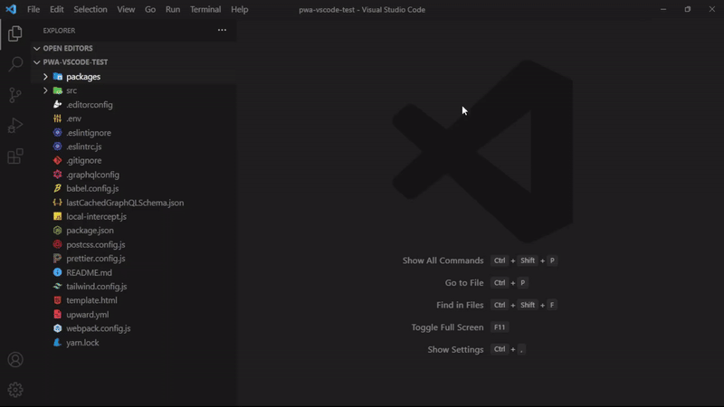

# PWA Studio Generator

This Visual Studio Code extension simplifies the process of generating components and extensions for PWA Studio.



## How to Use

1. Right-click on the folder where you want to create the extension or component.
2. Fill in the required inputs.

Alternatively, you can create components or extensions through Quick Open (Ctrl+P):

- To create an extension, search for `PWA Studio Generator: Create Extension`.
- To create a component, search for `PWA Studio Generator: Create Component`.

## Installation

1. Open Quick Open: `Ctrl+P`.
2. Paste the following command and press `Enter`:

```shell
ext install devgfnl.vscode-pwa-studio-generator
```

Alternatively, you can find and install it by searching for `vscode-pwa-studio-generator` (PWA Studio Generator) in the [VSCode marketplace](https://marketplace.visualstudio.com/items?itemName=devgfnl.vscode-pwa-studio-generator).

Certainly! Let's modify step 2 to make it more flexible:

### Adding Custom Templates

1. **Access Settings JSON:**
   Open the Quick Open dialog using `Ctrl+P`, then search for `Preferences: User Open Settings (JSON)`.

2. **Configure Component or Extension Template:**
   Add the following configuration for either a components or an extension template:
   ```json
   //...
    "devgfnl.pwaStudio.component": {
    "indexTemplate": "path/index.js",
    "componentCssTemplate": "path/component.module.css",
    "componentTemplate": "path/component.js"
   },
   "devgfnl.pwaStudio.extension": {
    "createReadme": true,
    "editorconfigTemplate": "path/.editorconfig",
    "eslintrcTemplate": "path/.eslintrc.js",
    "gitignoreTemplate": "path/.gitignore",
    "jestConfigTemplate": "path/jest.config.js",
    "prettierConfigTemplate": "path/prettier.config.js",
    "readmeTemplate": "path/README.md"
   }
   ```
   Choose either the `component` or `extension` block based on your needs.

#### Template Configuration Details

- **Component Template:**

  - `indexTemplate`: Path to the index.js file. This template should include the following variables:
    - `{componentNameFile}`: Placeholder for the component file name.

- `componentTemplate`: Path to the component.js file. This template should include the following variables:
  - `{componentNameFile}`: Placeholder for the component file name.
  - `{componentName}`: Placeholder for the component name.
- `componentCssTemplate`: Path to the component.module.css file.

- **Extension Template:**

  - `createReadme`: Set to `true` or `false` to determine whether to create a README file. Default is `true`.
  - `editorconfigTemplate`: Path to the .editorconfig file.
  - `eslintrcTemplate`: Path to the .eslintrc.js file.
  - `gitignoreTemplate`: Path to the .gitignore file.
  - `jestConfigTemplate`: Path to the jest.config.js file.
  - `prettierConfigTemplate`: Path to the prettier.config.js file.
  - `readmeTemplate`: Path to the README.md file.

  Ensure that your templates include these variables to properly replace them during the template creation process. Here's an example of how your component templates might look:

**index.js:**

```javascript
// Content of index.js template
export { default } from "./{componentNameFile}";

// Use the {componentNameFile} variable as needed
```

**component.js:**

```javascript
// Content of component.js template
import React from 'react';
import { mergeClasses } from '@magento/venia-ui/lib/classify';
import { shape, string } from 'prop-types';

import defaultClasses from './{componentNameFile}.module.css';

const {componentName} = props => {
    const classes = mergeClasses(defaultClasses, props.classes);
    return <div className={classes.root} />;
};

{componentName}.propTypes = {
    classes: shape({ root: string })
};
{componentName}.defaultProps = {};
export default {componentName};

// Use the {componentNameFile} and {componentName} variables as needed
```

Make sure to adjust the templates based on your specific use case and naming conventions. These are examples of how your templates might be structured.

For more examples and ready-to-use templates, you can explore the [defaults templates](https://github.com/GabrielFNLima/vscode-pwa-studio-generator/tree/main/templates).
